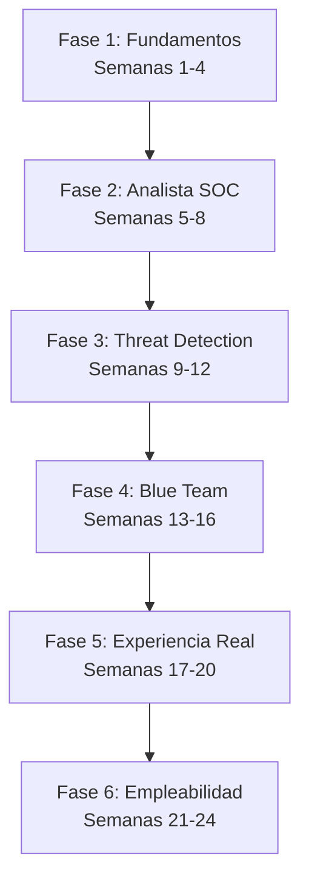

# 🛡️ SOC Analyst Journey: Ruta de Aprendizaje de Cero a L1

  
  
  

---

## 📖 Sobre el Proyecto

Este repositorio contiene una **hoja de ruta estructurada y metódica de 24 semanas (6 meses)** diseñada específicamente para cualquier persona que desee ingresar al mundo de la ciberseguridad defensiva y convertirse en un **Analista SOC (Security Operations Center) Nivel 1** altamente empleable. 

Aquí encontrarás apuntes limpios, recursos teóricos, laboratorios paso a paso, glosarios técnicos y guías prácticas basadas en estándares de documentación reales de la industria.

---

## 🗺️ Estructura del Road Map (24 Semanas)

El camino está dividido en **6 fases de aprendizaje progresivo**:

### 🗓️ Resumen de las Fases

| Fase | Semanas | Enfoque Principal | Documentación Principal |
| :--- | :--- | :--- | :--- |
| **Fase 1: Fundamentos** | 1 - 4 | Redes, Protocolos, Administración de Linux y Windows | [Ver Hoja de Ruta](file:///home/jo/Documentos/road_map_cyber/SOC_Hoja_De_Ruta.md#fase-1-fundamentos-semanas-1-a-4) |
| **Fase 2: Analista SOC** | 5 - 8 | Gestión de Logs, SIEM (Splunk) y Sysmon | [Ver Hoja de Ruta](file:///home/jo/Documentos/road_map_cyber/SOC_Hoja_De_Ruta.md#fase-2-analista-soc-semanas-5-a-8) |
| **Fase 3: Threat Detection** | 9 - 12 | MITRE ATT&CK, Malware, Phishing y OSINT | [Ver Hoja de Ruta](file:///home/jo/Documentos/road_map_cyber/SOC_Hoja_De_Ruta.md#fase-3-threat-detection-semanas-9-a-12) |
| **Fase 4: Blue Team** | 13 - 16 | Security Onion, IDS/IPS (Suricata) y Zeek | [Ver Hoja de Ruta](file:///home/jo/Documentos/road_map_cyber/SOC_Hoja_De_Ruta.md#fase-4-blue-team-semanas-13-a-16) |
| **Fase 5: Experiencia Real** | 17 - 20 | TryHackMe, CyberDefenders y Hack The Box | [Ver Hoja de Ruta](file:///home/jo/Documentos/road_map_cyber/SOC_Hoja_De_Ruta.md#fase-5-experiencia-practica-y-plataformas-semanas-17-a-20) |
| **Fase 6: Empleabilidad** | 21 - 24 | LinkedIn, Portafolio en GitHub y Preparación Técnica | [Ver Hoja de Ruta](file:///home/jo/Documentos/road_map_cyber/SOC_Hoja_De_Ruta.md#fase-6-marca-personal-y-empleabilidad-semanas-21-a-24) |

---

## 🗂️ Contenido de la Semana 1: Redes I

Los módulos teóricos y prácticos correspondientes a la **Semana 1** se encuentran organizados y limpios para su fácil lectura:

1. **[01. Modelo OSI](file:///home/jo/Documentos/road_map_cyber/Fase_1_Fundamentos/Semana_1_Redes_I/01_Modelo_OSI.md)**: El modelo teórico de interconexión de sistemas abiertos y su aplicación de seguridad.
2. **[02. Modelo TCP/IP](file:///home/jo/Documentos/road_map_cyber/Fase_1_Fundamentos/Semana_1_Redes_I/02_Modelo_TCP_IP.md)**: El modelo práctico sobre el que funciona Internet.
3. **[03. IP Pública y Privada](file:///home/jo/Documentos/road_map_cyber/Fase_1_Fundamentos/Semana_1_Redes_I/03_IP_Publica_Privada.md)**: Tipos de direccionamiento e implicaciones en el análisis SOC.
4. **[04. Máscaras de Subred](file:///home/jo/Documentos/road_map_cyber/Fase_1_Fundamentos/Semana_1_Redes_I/04_Mascaras.md)**: Identificación de Redes y Hosts.
5. **[05. Subredes](file:///home/jo/Documentos/road_map_cyber/Fase_1_Fundamentos/Semana_1_Redes_I/05_Subredes.md)**: Fundamentos de subnetting y segmentación de red.
6. **[06. Puerta de Enlace (Gateway)](file:///home/jo/Documentos/road_map_cyber/Fase_1_Fundamentos/Semana_1_Redes_I/06_Gateway.md)**: El punto de salida de la red local.
7. **[07. NAT](file:///home/jo/Documentos/road_map_cyber/Fase_1_Fundamentos/Semana_1_Redes_I/07_NAT.md)**: Traducción de Direcciones de Red.

* **[📖 Glosario de Términos y Siglas Críticas del SOC](file:///home/jo/Documentos/road_map_cyber/GLOSARIO.md)**: Cheat-sheet rápido de siglas esenciales de redes, herramientas y amenazas.

---

## 🗂️ Contenido de la Semana 2: Redes II

Los módulos teóricos correspondientes a la **Semana 2** se encuentran organizados y limpios para su fácil lectura:

1. **[Módulo 8. UDP](file:///home/jo/Documentos/road_map_cyber/Fase_1_Fundamentos/Semana_2_Redes_II/08_UDP.md)**: El protocolo de transporte rápido, sin conexión y sin garantías.
2. **[Módulo 9. Puertos](file:///home/jo/Documentos/road_map_cyber/Fase_1_Fundamentos/Semana_2_Redes_II/09_Puertos.md)**: Identificación de servicios y aplicaciones dentro de un dispositivo.
3. **[Módulo 10. TCP](file:///home/jo/Documentos/road_map_cyber/Fase_1_Fundamentos/Semana_2_Redes_II/10_TCP.md)**: El protocolo confiable y orientado a conexión (Three-Way Handshake).
4. **[Módulo 11. DHCP](file:///home/jo/Documentos/road_map_cyber/Fase_1_Fundamentos/Semana_2_Redes_II/11_DHCP.md)**: Asignación automática de IP, máscara, gateway y DNS (proceso DORA).
5. **[Módulo 12. HTTP y HTTPS](file:///home/jo/Documentos/road_map_cyber/Fase_1_Fundamentos/Semana_2_Redes_II/12_HTTP_HTTPS.md)**: Métodos, códigos de estado y la web cifrada.
6. **[Módulo 13. DNS](file:///home/jo/Documentos/road_map_cyber/Fase_1_Fundamentos/Semana_2_Redes_II/13_DNS.md)**: La agenda telefónica de Internet y sus ataques (DGA, tunneling, spoofing).

---

## 🗂️ Contenido de la Semana 3: Linux

Los módulos teóricos y el laboratorio correspondientes a la **Semana 3** se encuentran organizados y listos para practicar:

1. **[Módulo 14. Introducción a Linux y la Terminal (CLI)](file:///home/jo/Documentos/road_map_cyber/Fase_1_Fundamentos/Semana_3_Linux/14_Introduccion_CLI.md)**: Kernel, distribuciones, shell y primeros comandos (`ls`, `cd`, `pwd`, `cat`, `tail`).
2. **[Módulo 15. Estructura del Sistema de Archivos (FHS)](file:///home/jo/Documentos/road_map_cyber/Fase_1_Fundamentos/Semana_3_Linux/15_Estructura_Archivos_FHS.md)**: El árbol de directorios y dónde vive la evidencia (`/etc`, `/var/log`, `/tmp`).
3. **[Módulo 16. Permisos de Archivos (rwx)](file:///home/jo/Documentos/road_map_cyber/Fase_1_Fundamentos/Semana_3_Linux/16_Permisos.md)**: `chmod`, `chown`, notación octal y bits especiales.
4. **[Módulo 17. Gestión de Usuarios y Grupos](file:///home/jo/Documentos/road_map_cyber/Fase_1_Fundamentos/Semana_3_Linux/17_Usuarios_Grupos.md)**: `/etc/passwd`, `/etc/shadow`, `sudo` y detección de cuentas sospechosas.
5. **[Módulo 18. Gestión de Procesos](file:///home/jo/Documentos/road_map_cyber/Fase_1_Fundamentos/Semana_3_Linux/18_Procesos.md)**: `ps`, `top`, `kill`, señales y detección de procesos maliciosos.
6. **[Módulo 19. grep, Pipes y Análisis de Logs](file:///home/jo/Documentos/road_map_cyber/Fase_1_Fundamentos/Semana_3_Linux/19_grep_Analisis_Logs.md)**: Filtros avanzados y detección de fuerza bruta en `/var/log/auth.log`.
7. **[Módulo 20. Laboratorio Práctico de Linux](file:///home/jo/Documentos/road_map_cyber/Fase_1_Fundamentos/Semana_3_Linux/20_Laboratorio_Practico.md)**: Guía paso a paso: usuarios, permisos restrictivos y monitoreo de logs con `tail -f`.

---

## 🗂️ Contenido de la Semana 4: Windows

Los módulos teóricos y prácticos correspondientes a la **Semana 4** se encuentran organizados y listos para investigar como Analista SOC:

1. **[Módulo 21. Fundamentos de Windows](file:///home/jo/Documentos/road_map_cyber/Fase_1_Fundamentos/Semana_4_Windows/21_Fundamentos_Windows.md)**: Sistema operativo, kernel, User/Kernel Mode, procesos, servicios, usuarios y Registro.
2. **[Módulo 22. NTFS y Sistema de Archivos](file:///home/jo/Documentos/road_map_cyber/Fase_1_Fundamentos/Semana_4_Windows/22_NTFS_Sistemas_Archivos.md)**: Discos, particiones, permisos, ACL, herencia y archivos ocultos/temporales.
3. **[Módulo 23. Usuarios, grupos y autenticación](file:///home/jo/Documentos/road_map_cyber/Fase_1_Fundamentos/Semana_4_Windows/23_Usuarios_Grupos_Autenticacion.md)**: Cuentas locales, RID, UAC, NTLM vs Kerberos y Active Directory.
4. **[Módulo 24. Procesos y servicios](file:///home/jo/Documentos/road_map_cyber/Fase_1_Fundamentos/Semana_4_Windows/24_Procesos_Servicios.md)**: `tasklist`, proceso padre/hijo, `svchost`, `lsass` y persistencia por servicios.
5. **[Módulo 25. CMD y PowerShell](file:///home/jo/Documentos/road_map_cyber/Fase_1_Fundamentos/Semana_4_Windows/25_CMD_PowerShell.md)**: `ipconfig`, `netstat`, `whoami`, cmdlets y detección de LOLBins/PowerShell malicioso.
6. **[Módulo 26. Windows Event Logs](file:///home/jo/Documentos/road_map_cyber/Fase_1_Fundamentos/Semana_4_Windows/26_Windows_Event_Logs.md)**: Visor de eventos y Event IDs clave (4624, 4625, 4688, 4720, 7045, 1102).
7. **[Módulo 27. Seguridad de Windows](file:///home/jo/Documentos/road_map_cyber/Fase_1_Fundamentos/Semana_4_Windows/27_Seguridad_Windows.md)**: Defender, Firewall, BitLocker, Credential Guard, SmartScreen y defensa en profundidad.
8. **[Módulo 28. Windows desde la perspectiva del atacante](file:///home/jo/Documentos/road_map_cyber/Fase_1_Fundamentos/Semana_4_Windows/28_Windows_Perspectiva_Atacante.md)**: Recon, escalada, persistencia, credential dumping, movimiento lateral y LOLBins.
9. **[Módulo 29. Investigación SOC en Windows](file:///home/jo/Documentos/road_map_cyber/Fase_1_Fundamentos/Semana_4_Windows/29_Investigacion_SOC_Windows.md)**: Método de investigación, correlación de eventos, línea de tiempo y redacción de veredicto.

---

## 📚 Recursos PDF Incluidos

En la carpeta **[Recursos/](file:///home/jo/Documentos/road_map_cyber/Recursos/)** encontrarás documentación complementaria en formato PDF:
* **[Guía para principiantes de Wazuh](file:///home/jo/Documentos/road_map_cyber/Recursos/Guia-Wazuh-Principiantes.pdf)**: Guía práctica para comprender y configurar el agente EDR/SIEM de Wazuh.
* **[Creando máquina virtual](file:///home/jo/Documentos/road_map_cyber/Recursos/Creando_maquina_virtual.pdf)**: Guía paso a paso para el aprovisionamiento de tu hipervisor y laboratorios de pruebas.
* **[Manual de Auditoría](file:///home/jo/Documentos/road_map_cyber/Recursos/auditoria.pdf)**: Conceptos y directrices de auditoría de sistemas.

---

## 👥 Colaboradores y Créditos

Este proyecto es posible gracias al valioso aporte de los siguientes colaboradores:

| Colaborador | Rol / Contribución | GitHub |
| :--- | :--- | :--- |
|    **[Nombre Colaborador 1]** | Liderazgo del Roadmap / Redacción de Apuntes | [Gonzalo](https://github.com/GonzaloAtadia) |
|    **[Nombre Colaborador 2]** | Diseño del Repositorio / Laboratorios Prácticos | [@colaborador2](https://github.com/github_username_2) |
|    **[Jo!]** | Documentacion/ Revisión Técnica | [@Jo!](https://github.com/JoseloFlores) |

> 💡 *Si deseas aparecer en esta sección, lee las instrucciones de contribución a continuación.*

---

## 🤝 ¿Cómo Contribuir?

1. Haz un **Fork** del repositorio.
2. Crea una rama para tu característica: `git checkout -b feature/NuevaSeccion`.
3. Haz tus cambios respetando los estándares de formato y documentación.
4. Envía tu **Pull Request** detallando tus adiciones o correcciones.
