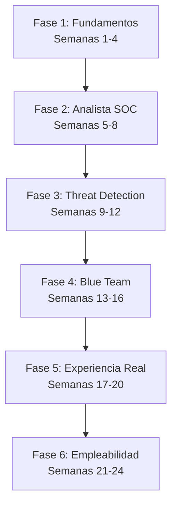

# 🛡️ SOC Analyst Journey: Ruta de Aprendizaje de Cero a L1

  
  
  

---

## 📖 Sobre el Proyecto

Este repositorio contiene una **hoja de ruta estructurada y metódica de 24 semanas (6 meses)** diseñada específicamente para cualquier persona que desee ingresar al mundo de la ciberseguridad defensiva y convertirse en un **Analista SOC (Security Operations Center) Nivel 1** altamente empleable. 

Aquí encontrarás apuntes limpios, recursos teóricos, laboratorios paso a paso, glosarios técnicos y guías prácticas basadas en estándares de documentación reales de la industria.

---

## 🗺️ Estructura del Road Map (24 Semanas)

El camino está dividido en **6 fases de aprendizaje progresivo**:

### 🗓️ Resumen de las Fases

| Fase | Semanas | Enfoque Principal | Documentación Principal |
| :--- | :--- | :--- | :--- |
| **Fase 1: Fundamentos** | 1 - 4 | Redes, Protocolos, Administración de Linux y Windows | [Ver Hoja de Ruta](file:///home/jo/Documentos/road%20map%20cyber/SOC_Hoja_De_Ruta.md#fase-1-fundamentos-semanas-1-a-4) |
| **Fase 2: Analista SOC** | 5 - 8 | Gestión de Logs, SIEM (Splunk) y Sysmon | [Ver Hoja de Ruta](file:///home/jo/Documentos/road%20map%20cyber/SOC_Hoja_De_Ruta.md#fase-2-analista-soc-semanas-5-a-8) |
| **Fase 3: Threat Detection** | 9 - 12 | MITRE ATT&CK, Malware, Phishing y OSINT | [Ver Hoja de Ruta](file:///home/jo/Documentos/road%20map%20cyber/SOC_Hoja_De_Ruta.md#fase-3-threat-detection-semanas-9-a-12) |
| **Fase 4: Blue Team** | 13 - 16 | Security Onion, IDS/IPS (Suricata) y Zeek | [Ver Hoja de Ruta](file:///home/jo/Documentos/road%20map%20cyber/SOC_Hoja_De_Ruta.md#fase-4-blue-team-semanas-13-a-16) |
| **Fase 5: Experiencia Real** | 17 - 20 | TryHackMe, CyberDefenders y Hack The Box | [Ver Hoja de Ruta](file:///home/jo/Documentos/road%20map%20cyber/SOC_Hoja_De_Ruta.md#fase-5-experiencia-practica-y-plataformas-semanas-17-a-20) |
| **Fase 6: Empleabilidad** | 21 - 24 | LinkedIn, Portafolio en GitHub y Preparación Técnica | [Ver Hoja de Ruta](file:///home/jo/Documentos/road%20map%20cyber/SOC_Hoja_De_Ruta.md#fase-6-marca-personal-y-empleabilidad-semanas-21-a-24) |

---

## 🗂️ Contenido de la Semana 1: Redes I

Los módulos teóricos y prácticos correspondientes a la **Semana 1** se encuentran organizados y limpios para su fácil lectura:

1. **[01. Modelo OSI](file:///home/jo/Documentos/road%20map%20cyber/Fase_1_Fundamentos/Semana_1_Redes_I/01_Modelo_OSI.md)**: El modelo teórico de interconexión de sistemas abiertos y su aplicación de seguridad.
2. **[02. Modelo TCP/IP](file:///home/jo/Documentos/road%20map%20cyber/Fase_1_Fundamentos/Semana_1_Redes_I/02_Modelo_TCP_IP.md)**: El modelo práctico sobre el que funciona Internet.
3. **[03. IP Pública y Privada](file:///home/jo/Documentos/road%20map%20cyber/Fase_1_Fundamentos/Semana_1_Redes_I/03_IP_Publica_Privada.md)**: Tipos de direccionamiento e implicaciones en el análisis SOC.
4. **[04. Máscaras de Subred](file:///home/jo/Documentos/road%20map%20cyber/Fase_1_Fundamentos/Semana_1_Redes_I/04_Mascaras.md)**: Identificación de Redes y Hosts.
5. **[05. Subredes](file:///home/jo/Documentos/road%20map%20cyber/Fase_1_Fundamentos/Semana_1_Redes_I/05_Subredes.md)**: Fundamentos de subnetting y segmentación de red.
6. **[06. Puerta de Enlace (Gateway)](file:///home/jo/Documentos/road%20map%20cyber/Fase_1_Fundamentos/Semana_1_Redes_I/06_Gateway.md)**: El punto de salida de la red local.
7. **[07. NAT](file:///home/jo/Documentos/road%20map%20cyber/Fase_1_Fundamentos/Semana_1_Redes_I/07_NAT.md)**: Traducción de Direcciones de Red.

* **[📖 Glosario de Términos y Siglas Críticas del SOC](file:///home/jo/Documentos/road%20map%20cyber/GLOSARIO.md)**: Cheat-sheet rápido de siglas esenciales de redes, herramientas y amenazas.

---

## 📚 Recursos PDF Incluidos

En la carpeta **[Recursos/](file:///home/jo/Documentos/road%20map%20cyber/Recursos/)** encontrarás documentación complementaria en formato PDF:
* **[Guía para principiantes de Wazuh](file:///home/jo/Documentos/road%20map%20cyber/Recursos/Guia-Wazuh-Principiantes.pdf)**: Guía práctica para comprender y configurar el agente EDR/SIEM de Wazuh.
* **[Creando máquina virtual](file:///home/jo/Documentos/road%20map%20cyber/Recursos/Creando_maquina_virtual.pdf)**: Guía paso a paso para el aprovisionamiento de tu hipervisor y laboratorios de pruebas.
* **[Manual de Auditoría](file:///home/jo/Documentos/road%20map%20cyber/Recursos/auditoria.pdf)**: Conceptos y directrices de auditoría de sistemas.

---

## 👥 Colaboradores y Créditos

Este proyecto es posible gracias al valioso aporte de los siguientes colaboradores:

| Colaborador | Rol / Contribución | GitHub |
| :--- | :--- | :--- |
|    **[Nombre Colaborador 1]** | Liderazgo del Roadmap / Redacción de Apuntes | [@colaborador1](https://github.com/github_username_1) |
|    **[Nombre Colaborador 2]** | Diseño del Repositorio / Laboratorios Prácticos | [@colaborador2](https://github.com/github_username_2) |
| " width="40" height="40" style="border-radius:50%"/>   **[Jo!]** | Documentacion/ Revisión Técnica | [@Jo!](https://github.com/JoseloFlores) |

> 💡 *Si deseas aparecer en esta sección, lee las instrucciones de contribución a continuación.*

---

## 🤝 ¿Cómo Contribuir?

1. Haz un **Fork** del repositorio.
2. Crea una rama para tu característica: `git checkout -b feature/NuevaSeccion`.
3. Haz tus cambios respetando los estándares de formato y documentación.
4. Envía tu **Pull Request** detallando tus adiciones o correcciones.
